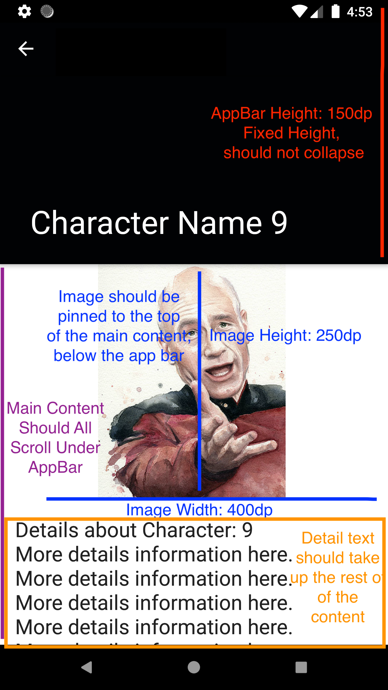
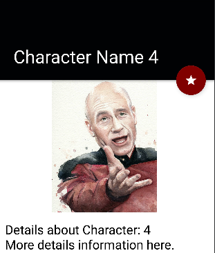
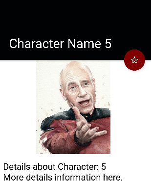

## Summary
When we're not busy programming, the URBN Mobile Team loves discussing our favorite show The Wire. 
To help us track our favorite characters, we started an app that lists them.
However, we're busy and we need some help finishing the app by adding some features.

## General Info
* We've included some common libraries but feel free to use others, giving your reasons why you chose them
* Add unit tests if you feel any are required
* Feel free to leave comments in the code regarding the implementation and any suggestions you may have
* We are unable to answer specific questions about the project tasks. If you have a general question please communicate with the recruiting coordinator.

## On Submission
* After you've completed the tasks below, submit a ZIP file with your entire Git repository (making sure the hidden `.git` directory is included).

## Tasks

1. Currently our app only uses stub data. Please use the following url 
`https://api.duckduckgo.com/?q=the+wire+characters&format=json`
to fetch the data we need for the character data class
```kotlin
data class Character(
  val name: String,
  val details: String,
  val imageUrl: String
)
```
the data returned from the api will appear as follows
```json
{
  "RelatedTopics" : [
    {
      "Text" : "Character Name - This is a description of the character",
      "Icon" : {
        "URL" : "/i/fae648d1.jpg"
      }
    }
  ]
}
```
The `imageUrl` can be constructed using the base url
`https://www.duckduckgo.com/i/fae648d1.jpg`
Use your best judgement to parse the `name` and `details` from the `Text` field.
Include any network error handling and prompting in the app, using SnackBars

2. Right now our detail screen is blank, Please follow the guides to create the layout as best you 
can.
* The Character's Name should be in the AppBar
* The Image should be 250dp by 400dp, pinned to bottom of the AppBar
* The detail text should take up the rest of the space below the Image
* make sure the entire content is scrollable, below the AppBar
* Use black for the detail text view color and 24sp for the detail text view size

 


3. Currently the Characters are sorted by the order returned in the data. We'd like to add the 
ability to sort the list in Alphabetical order and in Reverse Alphabetical order.
  * Please ensure the current sorting method is indicated in the contextual menu

4. (Senior Candidates Only) Provide a way to bookmark movies. 
You should be able to tell which movies are bookmarked in the list view.
Use the Star icons included in the project, with an example of how you might design it

   
    

5. (Senior Candidates Only) Add an offline mode to the app by using a Room database
to store the fetched Character data as well as the current state of uses liked characters. This
state should persist across app re-starts
